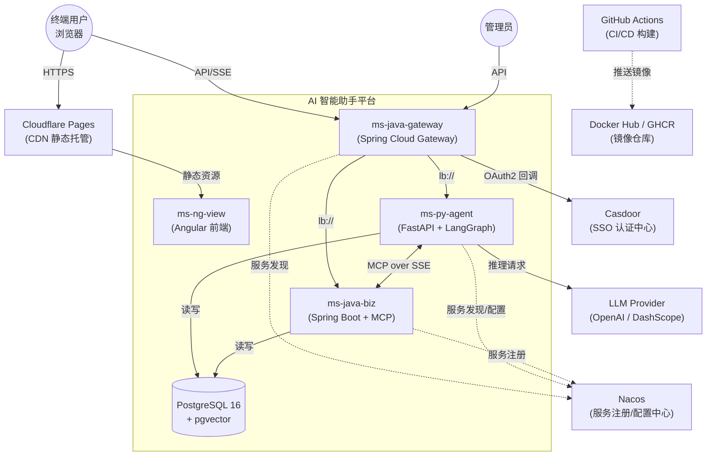
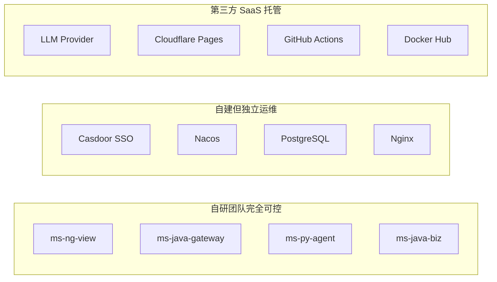
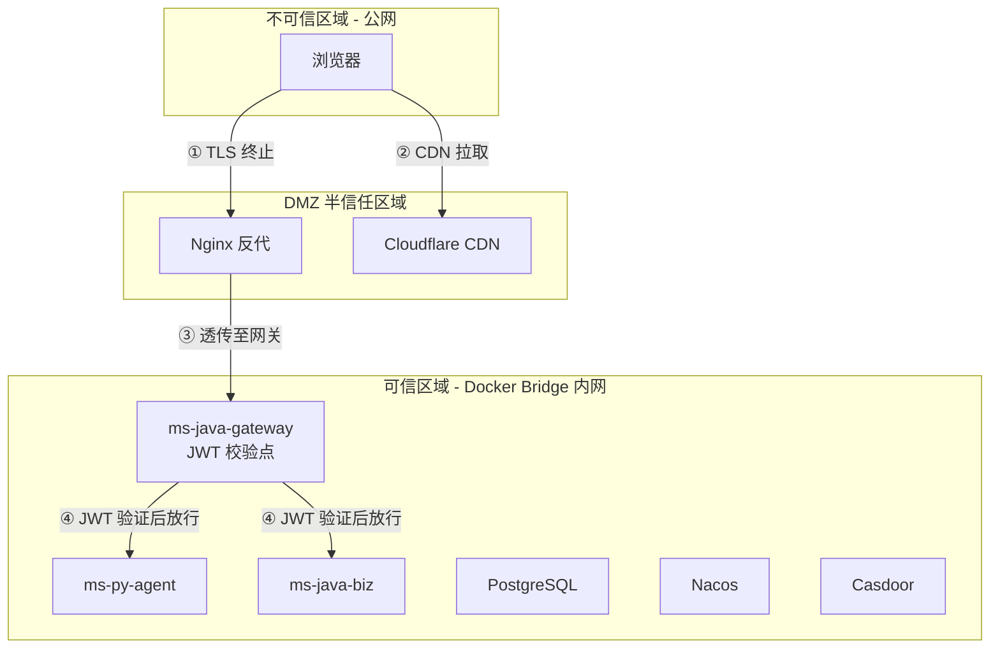
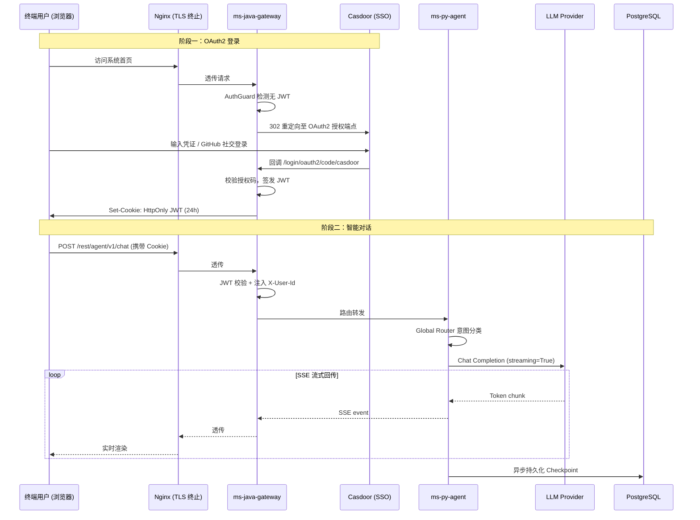

# 上下文视图 (Context View)
> **版本**: v1.0.0 **更新日期** : 2026-05-21

## 1. 视图概述

### 1.1 定位
上下文视图不属于 4+1 模型内部的四大视图，而是 4+1 模型的**前置输入**。通过上下文视图搞清楚系统边界——"系统是什么、不是什么、和谁交互"，为用例视图的 Actor 识别、物理视图的部署方案设计提供基础。

### 1.2 目标读者

| 角色 | 关注点 |
|---|---|
| 架构师 | 系统边界划定、外部依赖风险评估 |
| 安全工程师 | 信任边界、暴露面分析、STRIDE 威胁建模 |
| 运维工程师 | 外部实体 SLA、网络连通性、故障影响域 |
| 新成员 | 快速理解"系统和外部世界的关系" |

### 1.3 文档结构
本文档按照以下顺序组织：系统上下文模型 → 外部实体清单 → 接口规格说明 → 组织边界分析 → 信任边界分析 → 暴露面分析 (STRIDE) → 质量属性 → 变更影响分析 → 与其他视图的关系 → 接口时序图 → 用例追溯矩阵。

## 2. 系统上下文模型

## 3. 外部实体清单

| ID | 外部实体 | 类别 | 协议/传输 | 数据方向 | 关键依赖描述 |
|---|---|---|---|---|---|
| EXT-01 | **Casdoor** | SSO 认证中心 | HTTPS (OAuth2 / OIDC) | 双向 | 提供授权码登录、JWT 签发依据、用户信息端点；系统不自建账号体系 |
| EXT-02 | **LLM Provider** | AI 推理服务 | HTTPS (REST / SSE) | 请求→响应 | 提供 Chat Completion 推理能力；支持 OpenAI / DashScope 等多供应商动态切换 |
| EXT-03 | **Nacos** | 配置与注册中心 | HTTP (Open API) | 双向 | 服务注册发现 + 配置热加载（LLM Key、DB 连接串等）；全部后端服务强依赖 |
| EXT-04 | **PostgreSQL** | 关系型数据库 | TCP (pg protocol) | 双向 | 存储业务数据 + pgvector 向量索引 + LangGraph Checkpoint 状态持久化 |
| EXT-05 | **Cloudflare Pages** | CDN / 静态托管 | HTTPS | 单向（出站） | 托管前端构建产物，支持主分支/特性分支环境隔离 |
| EXT-06 | **GitHub Actions** | CI/CD 平台 | HTTPS / SSH | 单向（出站） | 自动构建多架构 Docker 镜像并 SSH 部署至 VPS |
| EXT-07 | **Docker Hub / GHCR** | 容器镜像仓库 | HTTPS | 单向（推/拉） | 存储 Java 网关、Java 业务、Python 大脑的多架构镜像 |
| EXT-08 | **Nginx** | 反向代理 | HTTPS→HTTP | 单向（入站） | 终止 TLS，透传 `X-Forwarded-*` 头给网关；系统唯一公网暴露入口 |

## 4. 接口规格说明

### 4.1 入站接口（系统接收）

| 接口 | 提供者 → 消费者 | 协议 | 路径模式 | 认证方式 | 说明 |
|---|---|---|---|---|---|
| 前端 API | 浏览器 → 网关 | HTTPS | `/rest/agent/v1/**` `/rest/biz/v1/**` `/api/business/**` | HttpOnly JWT Cookie | 网关按路径前缀路由至对应后端服务 |
| OAuth2 回调 | Casdoor → 网关 | HTTPS | `/login/oauth2/code/casdoor` | OAuth2 授权码 | Casdoor 登录成功后回调，网关校验并签发 JWT |
| MCP SSE 握手 | ms-py-agent → ms-java-biz | HTTP | `GET /mcp/sse` | JWT 透传 | 建立长连接，获取 SSE emitter 端点 |
| MCP 指令 | ms-py-agent → ms-java-biz | HTTP | `POST /mcp/messages` | JWT 透传 | JSON-RPC 格式的工具发现与调用指令 |

### 4.2 出站接口（系统发起）

| 接口 | 消费者 → 提供者 | 协议 | 说明 |
|---|---|---|---|
| LLM 推理 | ms-py-agent → LLM Provider | HTTPS (SSE) | Chat Completion API，streaming=True |
| 服务注册 | 各后端 → Nacos | HTTP | 启动时自注册，运行时心跳续约 |
| 配置拉取 | 各后端 → Nacos | HTTP | 拉取 LLM Key、DB 连接串等敏感配置 |
| 镜像推送 | GitHub Actions → Docker Hub | HTTPS | CI 构建产物推送至镜像仓库 |
| SSH 部署 | GitHub Actions → VPS | SSH | 远程拉取镜像、清理旧容器、重启服务 |

## 5. 组织边界分析

| 边界层 | 实体 | 可控程度 | 风险等级 |
|---|---|---|---|
| **自研可控** | 四个子工程 | 完全可控，代码、配置、部署自主决策 | 🟢 低 |
| **自建运维** | Casdoor, Nacos, PG, Nginx | 自行部署运维，版本升级自主；但故障需自行处理 | 🟡 中 |
| **第三方 SaaS** | LLM Provider, Cloudflare, GitHub, Docker Hub | 依赖外部服务可用性与定价策略；无法控制其停机与变更 | 🔴 高 |

## 6. 信任边界分析

| 信任边界 | 跨越点 | 防护机制 |
|---|---|---|
| **公网 → DMZ** | 浏览器 → Nginx | TLS 1.2+ 终止；Nginx 限流与 IP 黑名单 |
| **DMZ → 可信内网** | Nginx → 网关 | 透传 `X-Forwarded-*`；网关白名单校验 |
| **网关 → 后端服务** | 网关 → Agent / Biz | JWT 签名校验 + `X-User-Id` 身份注入；MCP 路径白名单放行 |
| **服务 → 数据库** | Agent / Biz → PG | 内网 TCP 连接；连接池凭证由 Nacos 下发，代码零硬编码 |
| **服务 → 外部 LLM** | Agent → LLM Provider | HTTPS 出站；API Key 由 Nacos 动态下发，运行时热更新 |

## 7. 暴露面分析 (STRIDE)

| 威胁类型 | 攻击面 | 当前缓解措施 | 残余风险 |
|---|---|---|---|
| **S (仿冒)** | 伪造 JWT Token | RS256 签名校验；Cookie HttpOnly + Secure 属性 | JWT 密钥泄露风险（由 Nacos 管理） |
| **T (篡改)** | 中间人篡改 API 请求 | 全链路 HTTPS；Nginx TLS 终止 | 内网 Docker bridge 间为 HTTP 明文传输 |
| **R (抵赖)** | 用户否认操作行为 | TraceId 全链路注入；INFO 级请求/响应日志 | 暂无审计日志持久化（规划于 release_2.0.0） |
| **I (信息泄露)** | 异常堆栈暴露给前端 | GatewayErrorHandler 消息脱敏清洗；超 200 字截断 | Actuator 仅暴露 `/health`；但日志文件需管控访问权限 |
| **D (拒绝服务)** | SSE 长连接耗尽资源 | Gateway 连接超时 10s + 响应超时 300s；G1 GC 调优 | 暂无专门的限流/熔断（规划引入 Resilience4j） |
| **E (权限提升)** | 越权访问他人数据 | 网关注入 `X-User-Id`，后端基于此隔离数据查询 | 当前无 RBAC 细粒度权限（规划于 release_2.0.0） |

## 8. 质量属性

| 质量属性 | 目标 | 实现机制 | 关联用例 |
|---|---|---|---|
| **可用性** | 核心对话链路 99.5% | MCP Fallback 降级（远端不可用时挂载本地插件）；Nacos 心跳续约 | UC01, UC10 |
| **性能** | SSE 首 Token < 2s | WebFlux 非阻塞网关 + asyncio 协程 + 透明代理无缓冲 | UC01, UC02 |
| **安全性** | 零 XSS / CSRF | HttpOnly Cookie + CSRF 关闭（API 网关模式）+ JWT 签名校验 | UC04 |
| **可维护性** | 新增工具零修改大脑层 | MCP 协议标准化 + 策略模式工具注册 + Nacos 动态发现 | UC07, UC10 |
| **国际化** | 中/英双语无脏读 | ContextVar 协程隔离 + YAML 翻译包 + 前端 ngx-translate | UC09 |
| **可测试性** | 核心链路 100% 覆盖 | H2 内存库 + Testcontainers PG + ArchUnit 架构守护 | 全部 |

## 9. 变更影响分析

| 变更场景 | 影响范围 | 缓解策略 |
|---|---|---|
| **LLM Provider 更换/停服** | ms-py-agent（LLMFactory） | Nacos 动态配置切换 Provider/Model/Key，无需重启；架构目标"模型无关性" |
| **Casdoor 版本升级** | ms-java-gateway（OAuth2 配置） | OIDC 标准协议解耦；仅需更新 issuer-uri 配置 |
| **PostgreSQL 大版本升级** | 全部后端服务 | Flyway 脚本不可变性原则；Testcontainers CI 预验证 Schema 兼容性 |
| **新增业务工具（MCP Tool）** | ms-java-biz（新增 McpTool 实现类） | 策略模式自动扫描注册；ms-py-agent 零改动，lifespan 动态发现 |
| **前端框架升级（Angular）** | ms-ng-view | 4-Layer 架构隔离；Domain/UseCase 层无框架依赖，仅 Adapter/UI 层受影响 |
| **Nacos 不可用** | 全部后端服务启动受阻 | 本地缓存上次配置快照；ms-py-agent MCP 降级至本地 filesystem 插件 |

## 10. 与其他视图的关系

| 关系 | 说明 |
|---|---|
| **上下文 → 用例视图** | 外部实体清单（§3）直接产出用例视图的 Actor 目录（EXT-01~03 → Casdoor/LLM/Nacos Actor） |
| **上下文 → 逻辑视图** | 系统边界内的四个子工程（§2）映射为逻辑视图的四大限界上下文 |
| **上下文 → 物理视图** | 外部实体的部署位置（§5 组织边界）直接驱动物理视图的 Docker 网络拓扑与 Nginx 反代设计 |
| **上下文 → 过程视图** | 接口协议（§4 的 SSE/REST/MCP）决定了过程视图中的并发与流式数据流转模型 |
| **上下文 → 开发视图** | 信任边界（§6）驱动了开发视图中 Gateway filter 链 Order 约束与 ArchUnit 防腐守护 |

## 11. 接口时序图

以下展示系统与外部实体交互最密集的场景——用户首次登录并发起对话：

## 12. 用例追溯矩阵

| 外部实体 | 关联用例 | 上下文章节 |
|---|---|---|
| **Casdoor (EXT-01)** | UC04 统一登录与注销 | §4.1 OAuth2 回调、§6 信任边界 |
| **LLM Provider (EXT-02)** | UC01 智能对话、UC02 RAG 问答 | §4.2 出站接口、§9 变更影响 |
| **Nacos (EXT-03)** | UC07 MCP 插件管理、UC10 MCP 工具调用 | §4.2 服务注册、§9 变更影响 |
| **PostgreSQL (EXT-04)** | UC02 RAG 问答、UC03 知识库管理、UC05 对话历史、UC08 文档入库 | §6 信任边界 |
| **Cloudflare (EXT-05)** | UC09 多语言切换（前端资源加载） | §5 组织边界 |
| **GitHub Actions (EXT-06)** | 全部用例（CI/CD 质量门禁） | §4.2 出站接口 |
| **Nginx (EXT-08)** | 全部用例（唯一公网入口） | §6 信任边界、§11 时序图 |