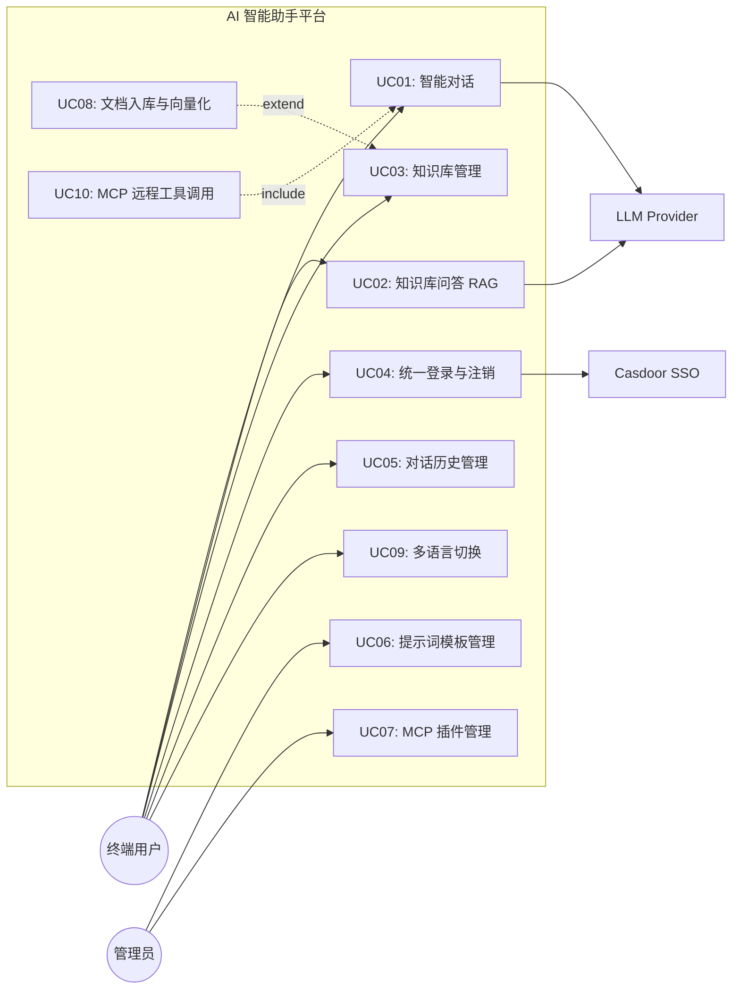
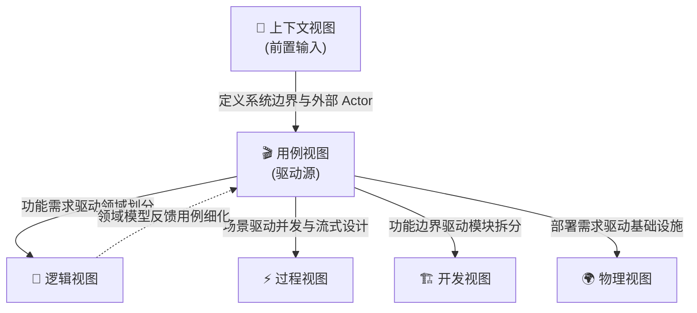

# 用例视图 (Usecase View)
> **版本**: v1.0.0 **更新日期** : 2026-05-20

## 1. 视图概述

### 1.1 定位
用例视图处于 4+1 模型的核心驱动位置，它通过将系统分解为实际的业务使用场景（Use Cases），自顶向下地贯穿、映射并验证其它四大视图（逻辑、过程、开发、物理）的合理性、鲁棒性与协作完整性。

### 1.2 目标读者

| 角色 | 关注点 |
|---|---|
| 产品经理 | 系统能做什么、用户价值交付的完整性 |
| 架构师 | 用例如何驱动系统分层、跨服务协作设计 |
| 开发者 | 明确功能边界，理解端到端调用链路 |
| 测试工程师 | 验收标准、P0/P1 场景覆盖率 |

### 1.3 文档结构
本文档按照以下顺序组织：Actor 目录 → 用例概览图 → 用例清单（P0/P1/P2 分级） → 关键用例详述 → 用例驱动声明 → 跨视图验证 → 非功能需求追溯 → 与其他视图的关系。

## 2. 用例模型

### 2.1 Actor 目录

| Actor | 类型 | 描述 |
|---|---|---|
| **终端用户 (End User)** | 主 Actor（人类） | 通过浏览器访问系统，进行对话、知识库管理、提示词管理等交互操作 |
| **系统管理员 (Admin)** | 主 Actor（人类） | 管理 MCP 插件、系统配置、用户权限等后台运维操作 |
| **Casdoor (SSO)** | 外部系统 | OAuth2 认证中心，提供统一登录、社交账号绑定和用户身份管理 |
| **LLM Provider** | 外部系统 | 大语言模型推理服务（如 OpenAI / DashScope），提供文本生成能力 |
| **Nacos** | 外部系统 | 服务注册发现与动态配置中心，提供服务寻址与配置热加载 |
| **ms-ng-view (前端门面)** | 内部系统 Actor | Angular 展现层，承载 AuthGuard 登录拦截、SSE 流式订阅、Signals 状态管理与 ngx-markdown 实时渲染 |
| **ms-java-gateway (统一网关)** | 内部系统 Actor | 系统流量咽喉，自主执行 JWT 校验、HttpOnly Cookie 签发/清除、TraceId 注入与路由分发 |
| **ms-py-agent (AI 大脑)** | 内部系统 Actor | LangGraph 编排的智能路由层，执行意图分类、RAG 检索与工具调度 |
| **ms-java-biz (业务中心)** | 内部系统 Actor | 核心业务能力提供者，通过 MCP 协议暴露知识库、提示词、订单等工具集 |

### 2.2 用例概览图

### 2.3 用例清单

#### P0 核心用例

| ID | 用例名称 | 主 Actor | 概述 |
|---|---|---|---|
| UC01 | 智能对话 | 终端用户 | 用户在对话界面输入自然语言提问，系统经 LangGraph 路由分发至对应子图，流式 SSE 返回大模型推理结果 |
| UC02 | 知识库问答 (RAG) | 终端用户 | 用户提问命中知识库意图后，系统执行 pgvector 向量检索 + BM25 混合检索 + RRF 重排，拼装上下文后交由 LLM 生成精准回答 |
| UC04 | 统一登录与注销 | 终端用户 | 用户通过 Casdoor SSO 完成 OAuth2 授权码登录，网关签发 HttpOnly JWT Cookie；注销时双端清理 Cookie 并重定向 |

#### P1 重要用例

| ID | 用例名称 | 主 Actor | 概述 |
|---|---|---|---|
| UC03 | 知识库管理 | 终端用户 | 用户创建/编辑/删除知识主题 (Topic)，管理主题下的文档列表（物理分页），支持级联删除 |
| UC05 | 对话历史管理 | 终端用户 | 用户查看历史会话列表、按会话浏览聊天记录、删除指定会话 |
| UC06 | 提示词模板管理 | 管理员 | 管理员创建/查看/版本化系统提示词模板，支持按 slug 查询和多版本迭代 |
| UC07 | MCP 插件管理 | 终端用户 | 用户浏览可用 MCP 插件列表，按需启用/禁用插件（用户级偏好），系统在 lifespan 中动态加载已启用插件的工具集 |
| UC08 | 文档入库与向量化 | 终端用户 | 用户上传文档后触发异步入库任务，系统自动分块、Embedding 向量化并写入 pgvector |
| UC10 | MCP 远程工具调用 | 内部 (AI 大脑) | 大模型推理判定需调用业务工具时，AI 大脑通过 MCP SSE 长连接向 Java 业务端发送 JSON-RPC 指令并获取执行结果 |

#### P2 扩展用例

| ID | 用例名称 | 主 Actor | 概述 |
|---|---|---|---|
| UC09 | 多语言切换 | 终端用户 | 用户在前端切换系统语言（中/英），偏好持久化至 localStorage，后端通过 ContextVar 协程隔离确保并发请求语言互不干扰 |
| UC11 | 用户资料展示 | 终端用户 | 从 SSO 获取用户信息（头像、昵称），在全局顶栏设置菜单中展示，支持跳转 Casdoor 账号管理 |
| UC12 | 倒计时活动管理 | 终端用户 | 用户创建/编辑/删除限时活动（TimeLimitedEvent），前端仪表盘展示倒计时状态 |

## 3. 关键用例详述

### 3.1 UC01: 智能对话

| 属性 | 内容 |
|---|---|
| **主 Actor** | 终端用户 |
| **前置条件** | 用户已完成 OAuth2 登录，持有有效 JWT Cookie |
| **触发条件** | 用户在对话界面输入消息并点击发送 |
| **主成功场景** | 1. 前端通过 `ChatUseCase` 发起 POST `/chat` 请求 2. 网关校验 JWT，注入 `X-User-Id` 头后转发至 ms-py-agent 3. Global Router 执行意图分类（优先关键词规则，fallback LLM） 4. 路由至对应子图（General / RAG / Coding） 5. 子图调用 LLM 推理，启用 `streaming=True` 6. ms-py-agent 通过 SSE StreamingResponse 逐 token 回传 7. 网关透明代理（无缓冲）转发至前端 8. 前端 RxJS 订阅流式数据，ngx-markdown 实时渲染 9. 对话记录异步写入 PostgreSQL (Checkpoint) |
| **扩展场景** | 5a. 子图判定需调用工具 → 转入 UC10 (MCP 远程工具调用) 5b. 命中 RAG 意图 → 转入 UC02 (知识库问答) |
| **后置条件** | 消息持久化完成，用户可在 UC05 中查看历史 |
| **涉及服务** | ms-ng-view → ms-java-gateway → ms-py-agent → LLM Provider |

### 3.2 UC02: 知识库问答 (RAG)

| 属性 | 内容 |
|---|---|
| **主 Actor** | 终端用户 |
| **前置条件** | 对应知识主题下已有文档且已完成向量化入库 |
| **触发条件** | Global Router 意图分类命中 RAG 领域 |
| **主成功场景** | 1. RAG 子图接收用户 query 和 topic_id 2. 并发执行：从 Java 端获取动态提示词模板 + 从 PG 执行混合检索 3. 提示词模板渲染：优先匹配 topic_id 专属模板，降级至通用模板，自动注入 `{{current_time}}` 4. 组装检索上下文 + 渲染后 System Prompt 5. 调用 LLM 生成回答，附带引用来源 (sources) 6. SSE 流式返回前端 |
| **异常场景** | 2a. 提示词模板获取失败 → 注入虚拟引用源警示卡片，对齐错误码 `DEP_0503` 2b. 检索结果为空 → LLM 基于通用知识回答并提示无专属知识 |
| **涉及服务** | ms-py-agent (RAG SubGraph) → ms-java-biz (Prompt/Knowledge API) → PostgreSQL (pgvector) |

### 3.3 UC04: 统一登录与注销

| 属性 | 内容 |
|---|---|
| **主 Actor** | 终端用户 |
| **前置条件** | 用户未持有有效 JWT 或 JWT 已过期 |
| **触发条件** | 用户首次访问系统，或在前端点击"登出" |
| **主成功场景（登录）** | 1. 前端 `AuthGuard` 拦截无 Token 请求 2. 重定向至网关 OAuth2 授权端点 3. `RedirectSaveFilter` 记录来源 URL 至 Cookie 4. 网关转发至 Casdoor 登录页 5. 用户完成账号密码或 GitHub 社交登录 6. Casdoor 回调网关，网关校验 OIDC Token 并签发 JWT 7. JWT 写入 HttpOnly Cookie（24h 有效，域名 `122577.xyz`） 8. 重定向至来源页面 |
| **主成功场景（注销）** | 1. 前端调用 `AuthService.logout()` 清除 localStorage 2. 重定向至网关 `/logout` 端点 3. 网关清除 HttpOnly Cookie 并终止后端会话 4. 重定向至 Casdoor 登录页 |
| **涉及服务** | ms-ng-view → ms-java-gateway → Casdoor |

### 3.4 UC10: MCP 远程工具调用

| 属性 | 内容 |
|---|---|
| **主 Actor** | ms-py-agent (内部系统) |
| **前置条件** | 系统启动时 lifespan 已完成 MCP 工具自动发现与注册 |
| **触发条件** | LLM 推理输出 `tool_calls` 指令 |
| **主成功场景** | 1. LangGraph 子图的 `should_continue` 节点检测到工具调用意图 2. 从 `mcp_tool_registry` 获取目标工具元数据 3. 构造 JSON-RPC `tools/call` 请求，透传 Authorization 头 4. 通过已建立的 MCP SSE 长连接发送至 ms-java-biz 5. Java 端 `McpController` 分发至对应 `McpTool` 实现类执行 6. 执行结果通过 SSE emitter 异步返回 7. AI 大脑将工具结果注入上下文，继续 LLM 推理生成最终回复 |
| **异常场景** | 3a. MCP 连接断线 → 捕获 `RemoteProtocolError`，自动重连重试 7a. 工具迭代次数超过 `MAX_TOOL_ITERATIONS` → 强制终止并记录 Warning |
| **涉及服务** | ms-py-agent (MCPToolRegistry) → ms-java-biz (McpController → McpTool 策略实现) |

## 4. 用例驱动声明

本系统的所有架构决策均由用例驱动：

| 架构决策 | 驱动用例 | 决策理由 |
|---|---|---|
| 引入 LangGraph 路由图 + 子图架构 | UC01, UC02 | 不同对话意图（闲聊、RAG、编程）需独立编排，单体图无法优雅扩展 |
| 采用 MCP over SSE 协议 | UC10 | AI 大脑与业务工具需完全解耦，新增工具零代码修改大脑层 |
| OAuth2 + HttpOnly Cookie 方案 | UC04 | 多子域共享登录态 + XSS 防护，Token 不暴露给 JavaScript |
| pgvector + BM25 混合检索 | UC02 | 纯向量检索语义漂移，纯关键词检索缺乏语义理解，混合方案互补 |
| ContextVar 协程隔离 i18n | UC09, UC01 | 高并发下多用户不同语言请求必须严格隔离，避免 Locale 脏读 |

## 5. 用例验证其他视图

| 用例 | 逻辑视图验证 | 过程视图验证 | 开发视图验证 | 物理视图验证 |
|---|---|---|---|---|
| UC01 智能对话 | 前端 4-Layer 分离（UI→UseCase→Adapter→Domain） | SSE 流式非阻塞时序 | Angular OnPush + RxJS 订阅结构 | 网关透明代理无缓冲 |
| UC02 RAG 问答 | 知识库领域与提示词领域解耦 | 并发检索 + 模板获取时序 | Python SubGraph 状态隔离 | pgvector 索引与 PG 部署 |
| UC04 统一登录 | 网关鉴权职责单一（只认 sub，不碰业务 Claims） | OAuth2 回调重定向流程 | Gateway filter 链 Order 约束 | Casdoor 容器内网互通 |
| UC10 MCP 工具调用 | AI 大脑与业务层 MCP 防腐隔离 | JSON-RPC SSE 双工通信时序 | McpTool 策略模式 + ArchUnit 守护 | Nacos 动态寻址 + Docker bridge |

## 6. 用例优先级和覆盖率

| 优先级 | 用例数 | 自动化测试覆盖 | 说明 |
|---|---|---|---|
| **P0 核心** | 3 (UC01, UC02, UC04) | ✅ 全覆盖 | 系统核心价值链路，任何回归必须 100% 绿灯 |
| **P1 重要** | 5 (UC03, UC05-UC08, UC10) | ✅ 全覆盖 | 业务完整性保障，含 Controller 切片测试 + 领域单测 |
| **P2 扩展** | 3 (UC09, UC11, UC12) | ⚠️ 部分覆盖 | UC09 有 50 协程并发隔离测试；UC11/UC12 暂依赖手工验证 |
| **合计** | **11 个用例** | **74 个自动化测试用例** | Java Gateway 20 + Java Biz 22 + Python 16 + Angular 16 |

## 7. 非功能需求追溯

| 非功能需求 | 关联用例 | 实现机制 |
|---|---|---|
| **安全性** | UC04 | HttpOnly Cookie + CSRF 关闭 + Actuator 端点最小暴露 + JWT 签名校验 |
| **高并发** | UC01, UC02 | WebFlux 非阻塞网关 + asyncio 协程 + SSE 流式透传 |
| **可用性** | UC10 | MCP Fallback 降级（远端不可用时挂载本地 filesystem 插件） |
| **国际化** | UC09 | ContextVar 协程隔离 + YAML 翻译包 + 前端 ngx-translate |
| **可观测性** | 全部用例 | 全局 TraceIdFilter 注入 32 位 hex Trace-ID，INFO 级耗时日志 |
| **数据一致性** | UC03, UC08 | ON DELETE CASCADE 外键级联 + AsyncPostgresSaver Checkpoint 持久化 |

## 8. 与其他视图的关系

| 关系 | 说明 |
|---|---|
| 用例 → 逻辑视图 | UC01-UC10 的功能边界直接映射为逻辑视图中的限界上下文（对话、知识库、提示词、MCP 插件） |
| 用例 → 过程视图 | UC01 的 SSE 流式对话与 UC10 的 MCP 工具调用直接驱动了过程视图中的时序图设计 |
| 用例 → 开发视图 | UC02 的 RAG 子图隔离需求驱动了 Python 端 `subgraphs/` 目录拆分；UC04 的鉴权需求驱动了 Gateway `filter/` 链式结构 |
| 用例 → 物理视图 | UC10 的跨服务 MCP 调用驱动了 Docker bridge 内网通信设计；UC04 的多域登录驱动了 Cookie 跨子域部署方案 |
| 上下文 → 用例 | 上下文视图界定的外部 Actor（Casdoor、LLM Provider、Nacos）直接成为用例模型中的参与者 |
