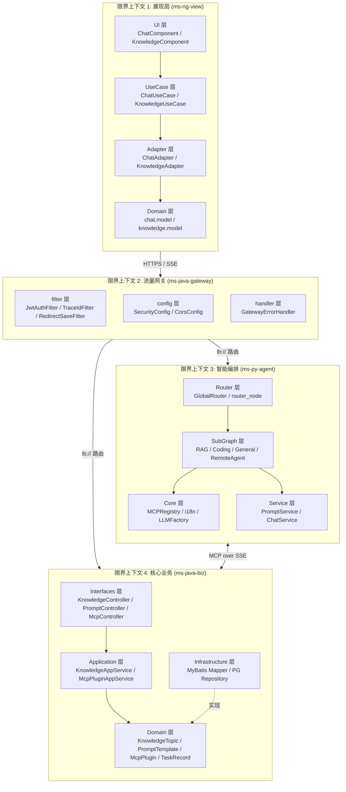
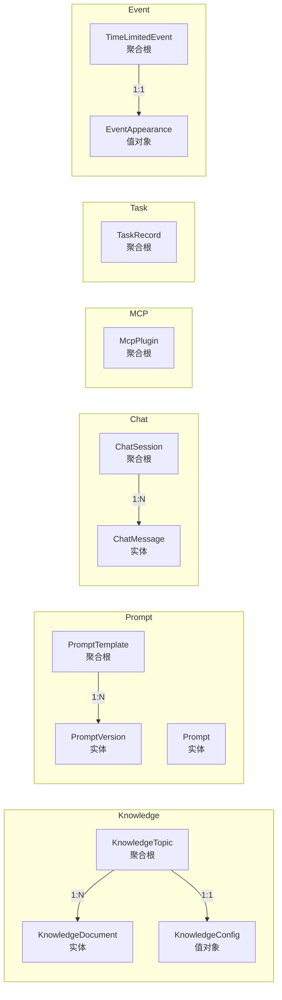
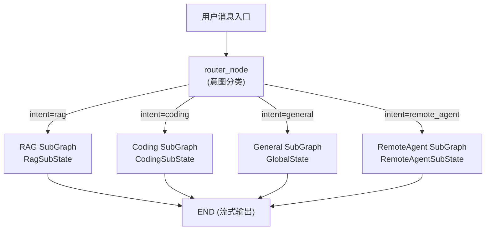
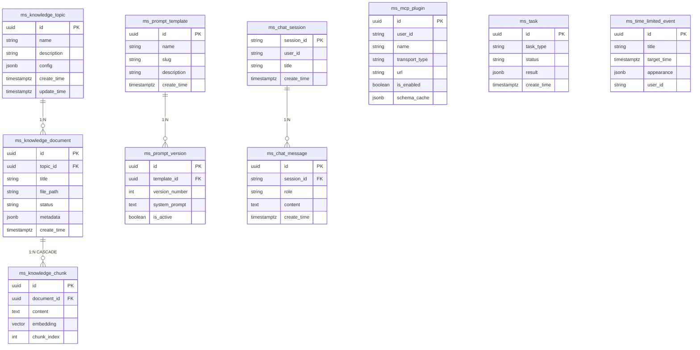
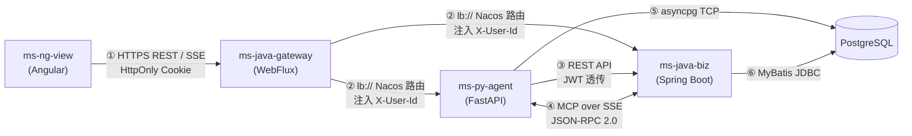

# 逻辑视图 (Logical View)
> **版本**: v1.0.0 **更新日期** : 2026-05-21

## 1. 视图概述

### 1.1 定位
逻辑视图侧重于系统的功能性需求，描述了系统内部的模块划分、领域边界以及它们之间的协作关系。在本项目中，逻辑架构严格遵循领域驱动设计（DDD）的思想进行系统级别的解耦。

### 1.2 目标读者

| 角色 | 关注点 |
|---|---|
| 架构师 | 理解系统的模块划分、领域边界以及它们之间的协作关系 |
| 开发者 | 如何正确调用下游服务，各层之间的依赖方向 |
| 技术管理者 | 系统分层、技术选型、演进路线 |
| 安全工程师 | 数据流威胁分析 |

### 1.3 文档结构
按三层模型组织：逻辑模型（What - 业务功能）→ 数据模型（What - 数据结构）→ 技术模型（How - 技术方案），最后补充威胁分析、设计原则、跨视图关系和用例追溯矩阵。

## 2. 逻辑模型（业务功能）

### 2.1 系统级限界上下文

系统由 4 个子工程组成，每个子工程对应一个独立的限界上下文 (Bounded Context)，通过明确的接口契约进行跨上下文通信。

### 2.2 ms-java-biz 领域模型（核心业务聚合）

核心业务层遵循 DDD 充血模型原则，按业务语义划分为 7 个领域子域：

| 领域 | 聚合根 | 实体 | 值对象 | 仓储接口 |
|---|---|---|---|---|
| **Knowledge** | `KnowledgeTopic` | `KnowledgeDocument` | `KnowledgeConfig` | `KnowledgeTopicRepository` `KnowledgeDocumentRepository` |
| **Prompt** | `PromptTemplate` | `PromptVersion`, `Prompt` | — | `PromptRepository` |
| **Chat** | `ChatSession` | `ChatMessage` | — | `ChatRepository` |
| **MCP** | `McpPlugin` | — | — | `McpPluginRepository` |
| **Task** | `TaskRecord` | — | — | `TaskRepository` |
| **Event** | `TimeLimitedEvent` | — | `EventAppearance` | `EventRepository` |
| **Common** | — | — | `PageResult` `BusinessException` | — |

### 2.3 ms-py-agent 智能编排模型

Python 大脑层采用 LangGraph 有状态图编排架构，核心模型是路由图 + 领域子图的二层结构：

| 状态类型 | 用途 | 专属字段 |
|---|---|---|
| `GlobalState` | 路由图与所有子图共享的最小化状态 | `messages`, `intent`, `topic_id`, `auth_header`, `sources`, `handled_by` |
| `RagSubState` | RAG 子图检索上下文 | `context` (知识片段), `rag_sources` (引用文档列表) |
| `CodingSubState` | 编程子图代码生成 | `code_language`, `code_result` |
| `RemoteAgentSubState` | A2A 远端 Agent 委托 | `remote_agent_name`, `remote_agent_url`, `a2a_task_id`, `artifacts` |

### 2.4 ms-ng-view 前端 4-Layer 架构

前端严格遵循整洁架构（Clean Architecture），自上而下 4 层单向依赖：

| 层次 | 目录 | 职责 | 约束 |
|---|---|---|---|
| **UI 层** | `features/chat/`, `features/knowledge/` 等 | 渲染数据 + 捕获用户事件（Dumb Components） | 严禁直接调用 HTTP，只通过 UseCase |
| **UseCase 层** | `core/use-cases/` | 业务逻辑编排，维护 Signals 页面状态 | 严禁直接 `fetch`，通过 Adapter 调用 |
| **Adapter 层** | `core/adapters/` | 封装 HttpClient，DTO→Domain 映射 (ACL) | URL 必须来自 `URLConfig` 常量 |
| **Domain 层** | `core/domain/` | 纯 TS interface / type，零框架依赖 | 严禁引入 Angular、RxJS 或外部库 |

### 2.5 ms-java-gateway 网关职责模型

网关贯彻**零业务逻辑原则**，职责收敛为三个包：

| 包 | 职责 | 核心类 |
|---|---|---|
| `config/` | 安全链配置、CORS、属性绑定 | `SecurityConfig`, `IgnoreWhiteProperties` |
| `filter/` | 请求拦截链（有序执行） | `TraceIdFilter` (Order -200) → `JwtAuthenticationFilter` (Order -100) → `RedirectSaveFilter` |
| `handler/` | 统一异常响应脱敏 | `GatewayErrorHandler`（消息>200字截断，堆栈不暴露） |

## 3. 数据模型（数据结构）

### 3.1 核心数据库 ER 关系

### 3.2 数据设计约束

| 约束 | 说明 |
|---|---|
| **表名规范** | 统一 `ms_` 前缀 + `snake_case` 单数形式 |
| **主键** | 统一 `id`（UUID 类型） |
| **时间字段** | `TIMESTAMPTZ` 带时区；Java 端映射为 `OffsetDateTime` |
| **级联删除** | `ms_knowledge_chunk` 通过 `ON DELETE CASCADE` 外键关联 `ms_knowledge_document` |
| **JSONB 弹性列** | `metadata` / `config` / `appearance` / `schema_cache` 均使用 JSONB 存储领域值对象 |
| **向量索引** | `ms_knowledge_chunk.embedding` 列建立 pgvector 索引，支持 ANN 近似最近邻搜索 |

## 4. 技术模型（技术实现）

### 4.1 跨限界上下文通信协议

| 编号 | 通信方式 | 协议 | 序列化 | 认证 |
|---|---|---|---|---|
| ① | 前端→网关 | HTTPS REST + SSE | JSON | HttpOnly JWT Cookie |
| ② | 网关→后端 | HTTP (Nacos lb://) | JSON | `X-User-Id` 头注入 |
| ③ | Agent→Biz REST | HTTP | JSON | JWT Token 透传 |
| ④ | Agent↔Biz MCP | HTTP SSE + POST | JSON-RPC 2.0 | JWT Token 透传 |
| ⑤ | Agent→PG | TCP (pg protocol) | Binary | Nacos 下发凭证 |
| ⑥ | Biz→PG | TCP (JDBC) | Binary | Nacos 下发凭证 |

### 4.2 关键技术决策

| 技术决策 | 选型 | 决策理由 | 驱动用例 |
|---|---|---|---|
| 智能体编排框架 | LangGraph StateGraph | 有状态图天然支持多步推理、工具循环和条件路由；Checkpointer 可持久化会话 | UC01, UC02 |
| 混合检索 | pgvector + BM25 + RRF | 纯向量语义漂移，纯关键词缺语义理解，RRF 重排融合两者优势 | UC02 |
| 工具协议 | MCP over SSE | 标准化 JSON-RPC 协议，AI 大脑与业务层完全解耦，新增工具零改动大脑 | UC10 |
| 前端架构 | 4-Layer Clean Architecture | UI/UseCase/Adapter/Domain 单向依赖，框架升级只影响 Adapter+UI 层 | UC01-UC09 |
| 认证方案 | OAuth2 + HttpOnly Cookie | 多子域共享登录态 + XSS 防护，Token 不暴露给 JavaScript | UC04 |
| 数据库 | PostgreSQL + pgvector 扩展 | 一库同时承载业务数据和向量索引，避免引入额外向量数据库运维成本 | UC02, UC08 |
| 国际化 | ContextVar + YAML | 协程隔离保证高并发 Locale 无脏读，YAML 翻译包人类可读 | UC09 |

## 5. 威胁分析

| 数据流 | 威胁 | 风险等级 | 缓解措施 |
|---|---|---|---|
| 前端→网关 | JWT 被窃取后冒充用户 | 🟡 中 | HttpOnly + Secure 属性；24h 过期；暂无 Refresh Token（规划 1.1.0） |
| 网关→Agent | `X-User-Id` 头伪造 | 🟢 低 | 网关为唯一注入点，后端服务在 Docker 内网不对外暴露 |
| Agent→LLM | Prompt 注入攻击 | 🟡 中 | System Prompt 从 Java 端集中管理，非用户可控；但用户输入未做深度过滤 |
| Agent↔Biz MCP | MCP 指令越权执行 | 🟡 中 | JWT Token 透传至 Biz 端校验；但当前 MCP 路径在网关为白名单放行 |
| Biz→PG | SQL 注入 | 🟢 低 | MyBatis-Plus 参数化查询；复杂 SQL 移至 XML 映射文件 |
| 前端 localStorage | Token 被 XSS 读取 | 🟢 低 | 核心 JWT 在 HttpOnly Cookie 中；localStorage 仅存语言偏好等非敏感数据 |

## 6. 与其他视图关系

| 关系 | 说明 |
|---|---|
| **逻辑 → 开发视图** | §2 的限界上下文划分直接映射为开发视图中的包结构（`domain/`, `application/`, `interfaces/`, `infrastructure/`） |
| **逻辑 → 过程视图** | §2.3 的 LangGraph 路由图 + 子图结构驱动了过程视图中的 SSE 流式时序设计 |
| **逻辑 → 物理视图** | §4.1 的跨上下文通信协议（lb://, MCP SSE）决定了物理视图中 Docker bridge 网络与 Nacos 寻址方案 |
| **上下文 → 逻辑** | 上下文视图的系统边界（4 个内部子工程）直接产出本视图的 4 个限界上下文 |
| **用例 → 逻辑** | UC01-UC12 的功能边界驱动了 §2.2 中 7 个领域子域的划分 |

## 7. 设计原则

| 原则 | 实践 | 守护机制 |
|---|---|---|
| **领域模型纯洁性** | Domain 层 Entity/VO 为纯 POJO，禁止引入 `@Entity`、Spring 注解或 ORM 依赖 | `ArchitectureDDDGuardTest` (ArchUnit 静态守护) |
| **充血模型** | 状态变更通过语义方法（如 `task.markCompleted()`），禁止暴露 Setter | 代码规范 + Code Review |
| **值对象不可变** | `KnowledgeConfig`、`EventAppearance` 等通过 JSONB 存储，Java 端为 immutable record | JSONB TypeHandler 自动映射 |
| **单向依赖** | `interfaces → application → domain ← infrastructure`，禁止反向依赖 | `ArchitectureDDDGuardTest` 应用层边界校验 |
| **防腐层 (ACL)** | 前端 Adapter 层执行 DTO→Domain 转换；Python Service 层封装 REST/MCP 调用 | 4-Layer 架构约束 + 前端 ESLint 规则 |
| **模型无关性** | LLM Provider 通过 `LLMFactory` 接口化，运行时 Nacos 动态切换 | 架构目标 (overview.md) |

## 8. 用例追溯矩阵

| 用例 | 涉及限界上下文 | 核心领域对象 | 通信协议 |
|---|---|---|---|
| **UC01** 智能对话 | BC1 → BC2 → BC3 | `GlobalState`, `ChatSession`, `ChatMessage` | HTTPS → SSE |
| **UC02** RAG 问答 | BC3 → BC4 | `RagSubState`, `KnowledgeTopic`, `KnowledgeDocument`, `PromptTemplate` | MCP SSE + REST |
| **UC03** 知识库管理 | BC1 → BC2 → BC4 | `KnowledgeTopic`, `KnowledgeDocument`, `KnowledgeConfig` | HTTPS REST |
| **UC04** 统一登录 | BC1 → BC2 → Casdoor | — (网关 filter 链处理) | OAuth2 / OIDC |
| **UC05** 对话历史 | BC1 → BC2 → BC4 | `ChatSession`, `ChatMessage` | HTTPS REST |
| **UC06** 提示词管理 | BC1 → BC2 → BC4 | `PromptTemplate`, `PromptVersion` | HTTPS REST |
| **UC07** MCP 插件管理 | BC1 → BC2 → BC4 | `McpPlugin` | HTTPS REST |
| **UC08** 文档入库 | BC1 → BC2 → BC3 → BC4 | `KnowledgeDocument`, `TaskRecord` | HTTPS REST + 异步任务 |
| **UC09** 多语言切换 | BC1 + BC3 | — (ContextVar + YAML 翻译包) | HTTP Header `Accept-Language` |
| **UC10** MCP 工具调用 | BC3 → BC4 | `GlobalState`, `McpPlugin` | MCP SSE (JSON-RPC) |
| **UC11** 用户资料 | BC1 → BC2 | — (JWT Claims 解析) | HTTPS REST |
| **UC12** 倒计时活动 | BC1 → BC2 → BC4 | `TimeLimitedEvent`, `EventAppearance` | HTTPS REST |
