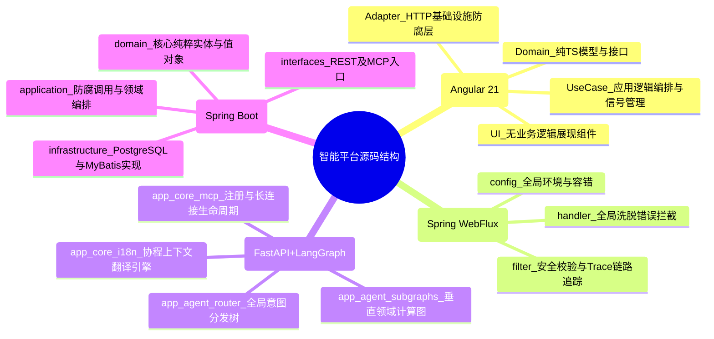

# 开发视图 (Development View)
> **版本**: v1.0.0 **更新日期** : 2026-05-21

## 1. 视图概述

### 1.1 定位
开发视图侧重于软件内部的静态结构和工程组织方式。它定义了开发人员在代码库中所看到的目录结构、组件复用方案、代码规范限制以及项目的依赖管理策略。

### 1.2 目标读者

| 角色 | 关注点 |
|---|---|
| 架构师 | 代码架构规范、模块解耦与代码级防腐边界设计 |
| 开发者 | 代码工程目录结构、如何组织代码、代码规范和架构卫兵要求 |
| 研发管理者 | 代码复用率、技术债务规避、开发协作边界 |

### 1.3 文档结构
本文档按照以下顺序组织：工程与模块划分架构 → 架构守护与规范限制 → 与其他视图的关系 → 用例追溯矩阵。

## 2. 工程与模块划分架构

本平台采用细粒度的多代码仓（或工作区）形式管理，各核心子工程内部严格贯彻领域驱动（DDD）或整洁架构标准：

## 3. 架构守护与规范限制
为了防止后续团队开发导致系统架构腐化，我们在工程中植入了严格的架构守护卫士：

- **Java 端 ArchUnit 静态卫兵**：在 `ms-java-biz` 中引入了 `ArchitectureDDDGuardTest`，于单元测试与 CI 期间强制校验：
  - `domain` 核心层必须保持高内聚，严禁混入外部框架包依赖。
  - `application` 层只能向下调，严禁反向越权依赖 `interfaces` 或暴露给外部展现技术细节。
- **Python 端有状态图解耦**：摒弃面条式代码结构，采用 LangGraph 将复杂 AI 逻辑重构为强规范的 Nodes（节点计算）与 Edges（条件边），依靠 TypedDict 构建的不可变 State 进行状态驱动。
- **统一中央错误管控**：各端代码均不硬编码异常，所有跨微服务及前后端的报错规范，统一对齐至全局协约文档 `ErrorCodeRegistry.md` 中的 `DEP_` 段位规范。

## 4. 与其他视图的关系

| 关系 | 说明 |
|---|---|
| **开发 → 逻辑视图** | 开发视图中的工程目录结构（如 domain, application）直接映射了逻辑视图的领域划分。 |
| **开发 → 物理视图** | 开发视图中定义的依赖与多模块结构决定了最终 Docker 镜像的构建与打包拆分方式。 |
| **用例 → 开发视图** | 核心用例（如 RAG、插件管理）直接驱动了代码工程的包隔离边界和依赖限制设计。 |

## 5. 用例追溯矩阵

| 用例 | 开发模块/包目录 | 核心设计模式/规范 | 代码卫兵限制 |
|---|---|---|---|
| **UC01 智能对话** | `ms-py-agent/app_agent_router/` | 状态图编程 (LangGraph) | State 严格限定类型 (TypedDict) |
| **UC02 RAG 问答** | `ms-py-agent/app_agent_subgraphs/rag/` | 策略与组合模式 | 严禁跨子图依赖污染 |
| **UC03 知识库管理** | `ms-java-biz/domain/knowledge/` | 充血模型，Repository 接口化 | 禁止引入持久化框架依赖 |
| **UC04 统一登录** | `ms-java-gateway/filter/` | 责任链模式 (Filter Chain) | Order 优先级明确校验，严禁侵入业务 |
| **UC10 MCP 远程工具调用** | `ms-java-biz/interfaces/mcp/` | MCP over SSE, 策略模式 (Strategy) | 异步推流，线程与连接超时隔离机制 |
