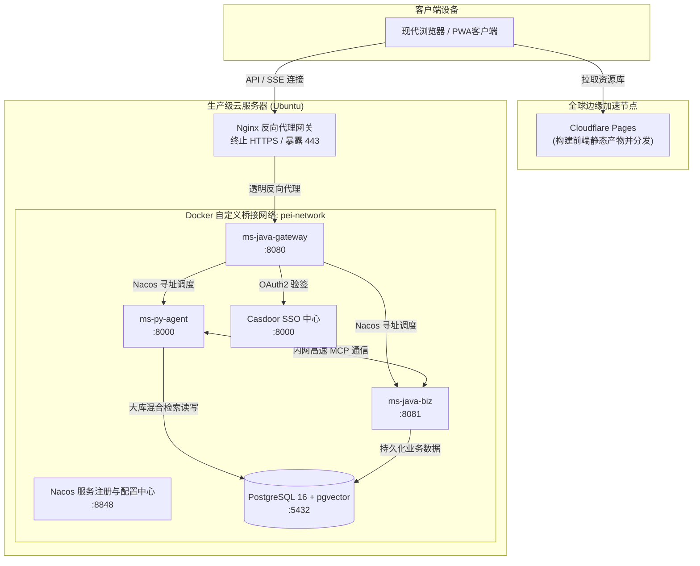

# 物理视图 (Physical View)
> **版本**: v1.0.0 **更新日期** : 2026-05-21

## 1. 视图概述

### 1.1 定位
物理视图描述了软件系统如何映射到实际的硬件设施与基础设施上。它展示了集群环境、部署网络拓扑、容器虚拟化方案以及微服务间的底层物理连通性。

### 1.2 目标读者

| 角色 | 关注点 |
|---|---|
| 架构师 | 系统级物理隔离、容灾机制与全局网络拓扑 |
| 运维工程师 | 部署环境搭建、CI/CD流水线、微服务间的物理连接与防火墙策略 |
| 安全工程师 | 系统内外网边界、数据库隔离机制、物理级安全防控 |

### 1.3 文档结构
本文档按照以下顺序组织：部署拓扑结构 → 基础设施关键机制 → 与其他视图的关系 → 用例追溯矩阵。

## 2. 部署拓扑结构

本平台整体架构采取了前后端物理分离以及微服务 Docker 容器化隔离的网络模型。

## 3. 基础设施关键机制
- **服务自发与动态配置热加载**：由于微服务架构动态性高，所有后端组件（Java网关、Java业务端、Python大脑端）在容器启动时均挂载于 Nacos 中心。这消除了一切 IP 地址硬编码问题，并允许我们在不重启容器的情况下下发如大模型 API Key、数据库等高敏配置。
- **CI/CD 自动化多重构建**：通过 GitHub Actions 组建高度自动化的持续集成部署体系：
  - 代码合并即触发 `linux/amd64` 与 `linux/arm64` 的 Docker 多架构镜像编译。
  - 完成后，利用 SSH 插件直连目标 VPS，自动化清理旧容器拉取新镜像，重写入桥接网络并重启服务，达成“无手工作业”的 CD 交付流。
- **双层隔离环境**：为了杜绝开发与生产的数据干扰，本地测试阶段启用极轻量的 `H2` 内存库，在 CI 流水线阶段则通过拉起 **Testcontainers** 提供物理隔离的 PG 沙盒进行强 Schema 防护，确保线上数据库绝对安全。

## 4. 与其他视图的关系

| 关系 | 说明 |
|---|---|
| **物理 → 过程视图** | 物理视图中的反向代理 Nginx 与容器内网桥接限制，直接支撑了过程视图中的安全 SSE 流式传输。 |
| **物理 → 逻辑视图** | 逻辑视图中限界上下文的解耦落地为物理视图中独立部署的 Docker 容器和开放的网络端口。 |
| **用例 → 物理视图** | 实际的部署拓扑方案、CDN 边缘加速及高可用数据库选型直接受系统核心用例的并发和安全容灾需求驱动。 |

## 5. 用例追溯矩阵

| 用例 | 部署组件与网络节点 | 物理环境与安全隔离 | 容灾/扩展策略 |
|---|---|---|---|
| **UC01 智能对话** | Nginx, Gateway, PyAgent, LLM API | Cloudflare CDN 边缘，HTTPS 终止，容器桥接网络 | 网关与智能大脑支持容器实例横向扩容 |
| **UC02 RAG 问答** | PostgreSQL (pgvector), PyAgent | 数据库容器仅对同内网可见，端口不暴露至公网 | PG 数据冷热备份与高可用方案准备 |
| **UC04 统一登录** | Casdoor, Nginx | 独立认证服务容器 | SSO 单点故障隔离，Cookie 顶层域名级绑定 |
| **UC08 文档入库** | JavaBiz, PG, 异步解析资源 | 向量化与拆分等重 CPU 任务的资源隔离边界 | 避免耗时的大文档入库拖垮核心业务进程响应 |
| **UC10 MCP 远程工具调用** | PyAgent <-> JavaBiz 内网信道 | `pei-network` Docker 内网隔离，外部无法直接访问 | 依赖 Nacos 动态寻址与心跳，保障内部高可用重连 |
