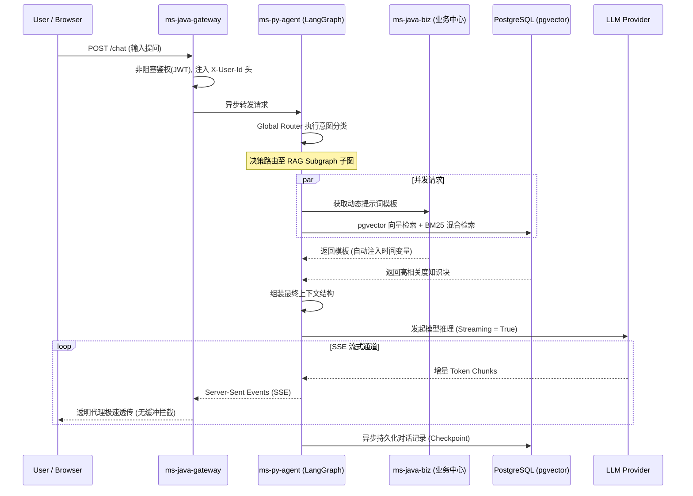

# 过程视图 (Process View)
> **版本**: v1.0.0 **更新日期** : 2026-05-21

## 1. 视图概述

### 1.1 定位
过程视图侧重于系统的非功能性需求，如并发、同步/异步控制、流式传输、性能和高可用性。它主要展示运行时的控制流与动态数据流转。

### 1.2 目标读者

| 角色 | 关注点 |
|---|---|
| 架构师 | 系统并发模型、时序流转及非功能性需求设计 |
| 开发者 | 核心用例的具体执行流程、异步并发实现机制 |
| 测试工程师 | 系统压力测试、流式通讯防抖逻辑、高可用验证方案 |

### 1.3 文档结构
本文档按照以下顺序组织：核心链路时序图 → 并发控制与性能设计 → 与其他视图的关系 → 用例追溯矩阵。

## 2. 核心链路：多步推理与流式对话 (SSE)

本场景详述了用户发起提问，系统进行意图分发、动态 Prompt 获取、RAG 检索以及流式返回大模型生成结果的并发过程。

## 3. 并发控制与性能设计
- **网关非阻塞 (Non-Blocking)**：Spring Cloud Gateway 采用 Reactor Netty，全链路异步非阻塞，保障高并发下的长时间长连接流式传输（SSE）不阻碍线程池。
- **Python 协程安全隔离 (Coroutine Isolation)**：`ms-py-agent` 使用 `asyncio` 结合 `ContextVar` 实现高并发环境下的强隔离。保障用户请求级别的 Locale 语言环境、Token 鉴权等上下文严格安全，杜绝内存脏读现象。
- **流式防抖与反压机制 (Debounce & Backpressure)**：前端（ms-ng-view）在接收快速到达的 SSE 流时利用 RxJS 绑定 `debounceTime` 进行节流渲染，并支持用户随时点击“暂停”切断上游生成流程。

## 4. 与其他视图的关系

| 关系 | 说明 |
|---|---|
| **过程 → 逻辑视图** | 过程视图中时序图的各个参与者（ms-py-agent, ms-java-biz等）对应逻辑视图中的限界上下文。 |
| **过程 → 物理视图** | 过程视图中定义的长连接与高并发流式传输（SSE）需求，直接影响了物理视图中反向代理及负载均衡策略。 |
| **用例 → 过程视图** | 用例视图定义的 UC01（智能对话）、UC02（RAG）和 UC10（MCP）直接驱动了此时序过程的设计。 |

## 5. 用例追溯矩阵

| 用例 | 涉及的过程组件 | 时序特征 | 数据流约束 |
|---|---|---|---|
| **UC01 智能对话** | Gateway, Agent, LLM | SSE 流式传输 (Streaming) | 文本块增量返回，不允许中间缓冲阻塞 |
| **UC02 RAG 问答** | Agent, Biz, DB | 并发请求 (Concurrent) | RAG 检索与提示词获取并发执行，完成后同步合并 |
| **UC04 统一登录** | Gateway, Casdoor | 异步重定向 | OAuth2 回调需支持分布式无状态拦截 |
| **UC10 MCP 远程工具调用** | Agent, Biz | JSON-RPC over SSE | 保持长连接双工通讯，支持断线防抖重连重试 |
