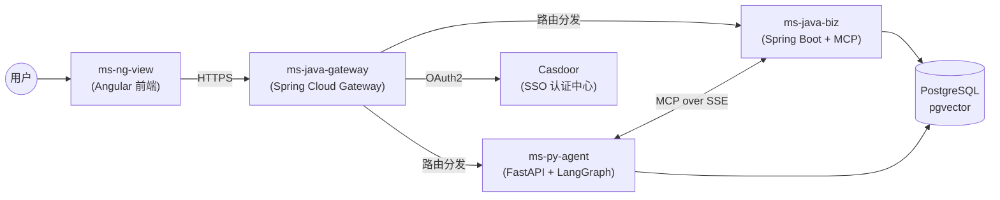

# 🏗️ 项目里程碑 (Project Milestones)

> 本文档记录整个 **AI 智能助手平台** 的版本演进与特性总结。  
> 平台由四个子项目协同构建，实现从用户交互到 AI 推理的完整链路。

---

## 系统架构总览

| 子项目 | 技术栈 | 角色 |
|-------|--------|------|
| **ms-ng-view** | Angular 21 + Material + TailwindCSS | 🖥️ 前端门面 |
| **ms-java-gateway** | Spring Cloud Gateway + WebFlux | 🚪 统一网关 |
| **ms-py-agent** | FastAPI + LangGraph + LangChain | 🧠 AI 大脑 |
| **ms-java-biz** | Spring Boot + LangChain4j + MyBatis-Plus | 🤖 业务工具 |

---

## ✅ release_1.0.0 — 端到端上线 (企业级全特性落地版)

> **状态**: 已完成  
> **目标**: 打造高可用、全栈国际化、具备高覆盖率测试看护与智能路由的多智能体 (Multi-Agent) 协同平台，打通全链路业务与推理闭环。

---

### 一、统一认证与安全沙箱 (Authentication & Security Sandbox)

实现了基于 Casdoor 的 OAuth2 单点登录体系与无状态 JWT 校验，隔离了服务间鉴权的完整安全链路，并对前端全局交互与登出流程进行了体验升级。

| 特性 | 涉及服务 | 说明 |
|------|---------|------|
| OAuth2 Code 登录 | Gateway | 对接 Casdoor SSO，支持多源社交登录与 GitHub 授权免密绑定 |
| HttpOnly Cookie | Gateway | 自动签发 24h 有效 JWT 并写入 HttpOnly Cookie，防 XSS 攻击且支持跨子域共享 |
| 跨子域 Cookie 共享 | Gateway | Cookie 写入 `122577.xyz` 二级域名，多子域名共享登录态 |
| 身份注入与透传 | Gateway | 解析 JWT 并向请求头自动注入 `X-User-Id` / `X-User-Name` / `X-User-Avatar` 属性 |
| 前端 SSO 集成 | ms-ng-view | `AuthGuard` + `AuthService` 实现未登录自动跳转、安全提取 URL Token 与请求拦截自动携带 |
| 登录后回源跳转 | Gateway | `RedirectSaveFilter` 记录来源页面，无状态注销时自动重定向回登录页 (FE008) |
| 全局顶栏重构 | ms-ng-view | 封装 `MsHeaderComponent`，支持侧边栏状态联动、头像展示与 Casdoor 账号管理免密跳转 (FE008) |
| 无状态注销与 Cookie 清理 | Gateway + 前端 | `/logout` 过滤器自动双端清理 HttpOnly Cookie，前端瞬间断开，杜绝残留登录态 (FE008) |
| 安全沙箱加固 | Gateway | 关闭 API CSRF，配置 IgnoreWhite 放行路径；Actuator 仅暴露无害 `/actuator/health` 端点，防止敏感信息泄漏 |

---

### 二、智能路由、多步推理与协程多语言 (Intelligent Routing, Inference & Thread-Safe i18n)

重构单体智能体为有状态多子图智能路由架构，并实现了线程与协程安全的高并发多语言动态适配。

| 特性 | 涉及服务 | 说明 |
|------|---------|------|
| LangGraph 智能路由架构 | ms-py-agent | 将单体图重构为**路由图 + 4个领域子图** (RAG, Coding, General, A2A) 架构，实现高性能意图分发 (FE013) |
| 协程安全 Locale 中间件 | ms-py-agent | 采用 `ContextVar` 实现协程隔离的 Accept-Language 拦截器与生命周期重置，消除脏 Locale 读写 (FE018) |
| YAML 国际化翻译引擎 | ms-py-agent | 设计中英文 YAML 翻译包，彻底重构网络超时、文件解析及子图加载等所有硬编码中文 (FE018) |
| 前端 Signals i18n | ms-ng-view | 引入 `LanguageService` (Angular Signals) 与 `APP_INITIALIZER` 语言资源预加载，支持本地偏好持久化 (FE001) |
| 动态意图分类 Prompt | ms-py-agent ↔ biz | LLM Fallback 分类的 System Prompt 从 Java 端动态获取，失败时平滑降级至本地预置模版 (FE013) |
| 状态持久化与断点续聊 | ms-py-agent | `AsyncPostgresSaver` 支持 psycopg 隔离连接池读写 Checkpoint，保证 AI 状态高可靠有状态会话恢复 |
| 动态 LLM 热重载配置 | ms-py-agent | 运行时从 Nacos 动态拉取配置，支持 LLM Provider/Model/API Key 免重启热更新 |

---

### 三、知识库检索底座、大一统重构与物理分页 RAG (Consolidated pgvector & Physical Pagination RAG)

消除了本地域与通用域的冗余，打通了服务器物理分页与前端响应式重载机制。

| 特性 | 涉及服务 | 说明 |
|------|---------|------|
| 数据底座大一统重构 | ms-py-agent + biz | 废弃 FAISS 本地存储与专用食谱表，并入通用 `ms_knowledge_document` 与分块表，支持 GIN 索引扩展 (FE016) |
| JSONB 领域元数据 | ms-py-agent + biz | 在大一统通用表中利用 **JSONB `metadata`** 列弹性存储食谱难度、分类等特定垂直领域元数据 (FE016) |
| 物理分页双模响应 | ms-java-biz | 重写文档列表接口，整合 MyBatis-Plus 分页插件拦截器，无分页参数时返回全量以实现 100% 向下兼容 (FE017) |
| 前端 Signals 状态下沉 | ms-ng-view | 分页状态信号 (Signals) 从表现层下沉至用例层 `KnowledgeUseCase`，利用 `effect` 监听响应式触发分页重载 (FE017) |
| 混合检索与增强生成 | ms-py-agent | 混合 pgvector 向量搜索 + BM25 检索 + RRF 重排序，完成精准上下文装配，交付给大模型生成回答 |
| 物理级联清理 | ms-java-biz | `ms_knowledge_chunk` 与主表建立 `ON DELETE CASCADE` 外键关联，支持主题及文档的安全级联删除 |
| 知识库管理界面 | ms-ng-view | 完备的知识库列表浏览与 Embedding 挂载管理界面（`knowledge` 与 `knowledge-embedding` 模块） |

---

### 四、提示词中心管理、全链路错误自愈与虚拟引用源 (Prompt Management, Error Propagation & Virtual Sources)

废弃了本地硬编码 Prompt 机制，实现了完善的跨服务异常捕获与前端自愈提醒显示。

| 特性 | 涉及服务 | 说明 |
|------|---------|------|
| 零硬编码 Prompt 渲染 | ms-py-agent ↔ biz | 彻底移除 Python 端硬编码提示词，强制从 Java 后端拉取模板进行渲染，实现系统提示词中心化管理 (FE012/FE016) |
| 双级模板检索逻辑 | ms-py-agent | 渲染时优先匹配 `topic_id` 的专属模板格式，找不到时自动降级匹配通用的知识库模板 (FE016) |
| 动态时间变量注入 | ms-py-agent | 支持模板格式中数据库配置变量，系统级自动注入 `{{current_time}}` 与 `{{today}}` 元数据 (FE016) |
| 全链路错误码适配 | ms-py-agent ↔ biz | 引入 `error_context` 全链路捕获网络离线、模板缺失及格式校验异常，对齐 `DEP_0100`/`DEP_0503` 错误码 (FE016) |
| 虚拟引用源警示传播 | ms-py-agent ↔ 前端 | 异常时在回复 sources 首行注入带错误码的虚拟警告卡片，前端 4-Layer 架构零改动实现美观报错提醒 (FE016) |

---

### 五、能力集、MCP 插件生态与防腐解耦 (Capability Sets, MCP Plugins & Isolation)

解耦了推理大脑与实体业务工具集，支持动态的连接注册、生命周期管理与弹性容错。

| 特性 | 涉及服务 | 说明 |
|------|---------|------|
| MCP 插件白名单管理 | ms-java-biz | 引入 `ms_mcp_plugin` 数据表管理连接配置，提供 `ToggleMcpPlugin` 服务及用户偏好开关持久化 (FE014) |
| 动态能力集注册 | ms-py-agent ↔ biz | 基于官方 `mcp` 协议 SDK，启动 lifespan 时动态向 Python 大脑注册已启用工具，消除 tools 与 plugins 新增硬编码 (FE013/FE014) |
| 弹性 Fallback 机制 | ms-py-agent | Nacos 无法获取 Java MCP 插件或加载失败时，自动重试，最终降级挂载本地 filesystem 插件 (FE014) |
| MCP SSE 长连接服务端 | ms-java-biz | `GET /mcp/sse` 握手长连接与 `POST /mcp/messages` 指令分发，支持异步 emitter 非阻塞响应 |
| Stdio CLI 插件兼容 | ms-py-agent | 支持标准输入输出流集成外部工具（如 Brave Search），提供丰富的混合能力集 |
| 订单查询工具 | ms-java-biz | 落地 `OrderQueryTool` (实现 `McpTool` 策略模式接口)，作为首个标准 MCP 远程业务执行工具并入注册中心 |

---

### 六、微服务治理、可观测性与全链路体验 (Governance, Observability & Full-link UX)

构建了高可用的链路分析底座，并完成了前端排版引擎与防抖控制的开发。

| 特性 | 涉及服务 | 说明 |
|------|---------|------|
| 链路追踪与请求闭环 | Gateway | `TraceIdFilter` 采用非阻塞 doFinally 拦截，全局 INFO 级输出请求路径、耗时、状态与 Trace-Id (FE010) |
| 异常消息脱敏清洗 | Gateway | 拦截下游异常并清洗，对 ConnectException 进行脱敏返回友好提示，严禁原始堆栈向前端暴露 (FE010) |
| 前端 Markdown 渲染 | ms-ng-view | 全局提供 `ngx-markdown` 引擎，对流式 SSE 数据进行多级标题、代码块、表格的逐字实时渲染与样式适配 (FE011) |
| 流式请求暂停与防抖 | ms-ng-view | 对输入框进行 300ms 交互防抖；发送按钮实时绑定 RxJS 生成订阅，支持点击“暂停”切断 SSE 生成 (FE011) |
| 中央业务错误码注册 | 跨服务 | 统一维护 `ErrorCodeRegistry.md`，对齐 DEP 前缀与段位码，前端 HttpInterceptor 实现统一鉴权拦截 (FE010) |
| Nacos 配置发现治理 | 跨服务 | 所有服务基于 Nacos 实现自注册与运行时动态路由，多模块无感关联 |
| JVM 内存与 GC 调优 | 网关+业务 | 设置 MaxMetaspace 内存限制红线并配置 G1 GC，实现低延迟高吞吐并发响应 |

---

### 七、全方位测试防护与自动化 CI/CD 质量门禁 (Total Test Protection & CI/CD Pipelines)

推行 TDD 研发流程，首度引入了全工程、双层数据库隔离的自动化测试套件与自动化 CI 构建编译管线。

| 特性 | 涉及服务 | 说明 |
|------|---------|------|
| 双层数据库隔离测试 | ms-java-biz | 本地默认执行 H2 内存数据库测试；CI (GitHub Actions) 自动拉起 **Testcontainers (PostgreSQL 16)** 验证物理 Schema |
| 架构守护与切片测试 | 全服务 | 运用 `@WebMvcTest` 与 Architecture 守护类对网关 filter 链 order 优先级进行断言 (FE002/FE003) |
| DDD 静态架构卫兵 | ms-java-biz | 新增 `ArchitectureDDDGuardTest` (ArchUnit 静态守护)，断言领域层、应用层单向依赖纯洁性，防止未来代码劣变 |
| 协程隔离并发验证 | ms-py-agent | 在 `test_i18n.py` 中并发启动 50 个异步协程，断言 contextvar 语言上下文的完全隔离，无任何内存交叉脏读 (FE018) |
| GitHub Actions 编译管线 | 全部服务 | 覆盖 Docker 多架构构建（`linux/amd64`, `linux/arm64`），向主分支合并自动触发 |
| VPS 自动 SSH 部署部署 | 全部服务 | 构建成功后 SSH 远程安全拉取、隔离配置注入并自动重启镜像，实现完整的 CD 闭环 |
| Cloudflare Pages 部署 | ms-ng-view | 前端自动部署到 Cloudflare CDN，支持主分支与特性分支的隔离部署环境 |
| 自动化单元/集成测试 | 全部服务 | 覆盖 74 个自动化用例（Java Gateway 20、Java Biz 22、Python 16、Angular Jest 16），全链路 100% 绿灯看护 (FE003) |

---

## 🔮 后续版本规划（草案）

### release_1.1.0 — 体验优化与稳定性
- [ ] Token 自动续期（Refresh Token 机制）
- [ ] Chat 消息 of Like/Dislike 反馈
- [ ] 对话内容复制 / 导出 / 重新生成
- [ ] 知识库文档上传与处理进度展示
- [ ] 错误边界与优雅降级
- [ ] **跨服务系统级鉴权 (System-to-System Auth)**: 跨服务 RPC 引入 JWT/OIDC 签名认证，解除白名单，实现安全闭环 (FE015)

### release_1.2.0 — 多模态与工具扩展
- [ ] MCP 插件市场（前端管理界面）
- [ ] 更多 MCP 工具（网络搜索、日历、邮件等）
- [ ] 多模态输入（图片 / File 上传）
- [ ] AI 计费与用量统计面板（AiBillingFilter）

### release_2.0.0 — 企业级能力
- [ ] 多租户隔离
- [ ] RBAC 权限管理
- [ ] 审计日志
- [ ] 高可用部署（Kubernetes 编排）
- [ ] 监控与告警（Prometheus + Grafana）

---

> 📅 文档维护：随版本迭代持续更新  
> 📝 最后更新：2026-05-19
