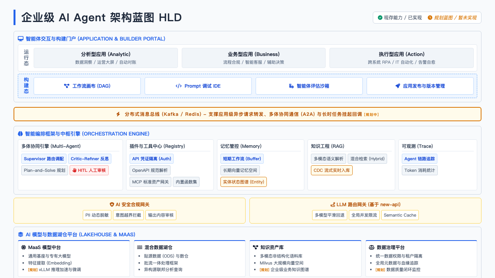
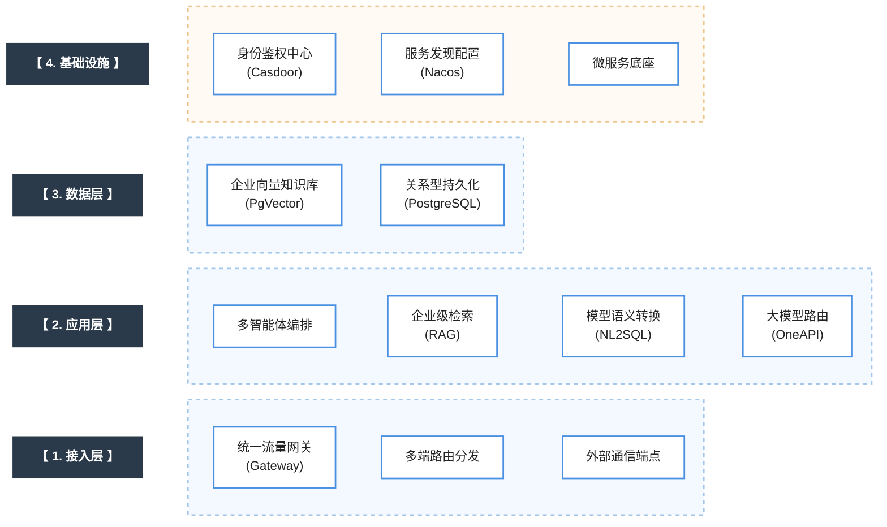

#

## skills

using-superpowers：[元控制] 强制规定系统在对话和操作前的技能检索与调用纪律。
api-design-principles：[规范] REST/GraphQL API 设计原则及 YAML 格式命名规范。
brainstorming：[流程] 在编码前进行的脑暴、需求梳理与特性文档输出规范。
debugging-strategies：[调试] 复杂 Bug 的系统化排查策略与根因分析（RCA）步骤。
lightning-architecture-review：[架构] 核心修改前的架构决策、风险分析（ADR）及影响评估。
test-driven-development：[开发] TDD（测试驱动开发）红绿循环强制执行标准。

## 整体架构

### 架构演进全过程总结

在本次沟通中，我们共同完成了一项从“概念草图”**到**“企业级生产可用蓝图”的架构推演与重构工作。具体演进路径如下：

1. **V1.0 - V2.0 (骨架构建与工程化引入)：** 基于你提供的原始参考图，划分了标准的四层架构。随后采纳建议，将“知识工程”与“编排引擎”深度耦合，并在底层引入了具体的工程化基础设施（如 Docker、Casdoor、Nacos），使架构具备了云原生底座的雏形。
2. **V3.0 - V3.1 (核心缺陷修复与现状映射)：** 经过客观评审，识别出高并发和合规链路上的缺失。引入了 **LLM API 网关（new-api）**、可观测性链路追踪、以及数据脱敏模块。同时，通过“已实现”与“规划中”的图例区分，真实反映了当前依赖 Cloudflare WAF 和暂缺 Prometheus/ELK 的现状。
3. **V3.2 - V3.3 (引擎细化与数据平台重构)：** 细化了编排引擎内部的动态 CoT、工具集和独立记忆库。将底层原本零散的数据库抽象升级为“AI 模型与数据湖仓平台 (Lakehouse & MaaS)”，赋予了平台处理批流一体数据和全生命周期模型资产的能力。
4. **最终版 HLD (对标业界 TOP 架构)：** 引入业界最佳实践（如 Coze、Dify、LangGraph），填补了最后四个关键盲区：
* 补充了提供可视化编排的“构建态 (Studio)”，并与应用层合并为统一门户。
* 明确了**多智能体协同模式**（Supervisor / Critic-Refiner）。
* 引入了高危场景必备的 **HITL (人工审核接管)**。
* 将**分布式消息总线**独立提级至门户与引擎之间，支撑真正的异步高并发。

---

### 企业级 AI Agent 架构蓝图 (HLD) 详细解析

当前最新架构自上而下分为六大核心逻辑层。以下是各层级及其内部模块的技术深度解析：

*(注：若需查看具有动态高亮、完整图标和鼠标悬停交互效果的网页版，可直接点击：[架构蓝图 HLD 交互版](./images/AIAgent%20HLD_white.html))*

#### 1. 智能体交互与构建门户 (Application & Builder Portal)

这是整个平台的最上层“控制面”，明确区分了面向最终用户的“运行态”和面向开发/运营人员的“构建态”。

* **运行态 (Runtime)：** Agent 能力的具体输出场景。涵盖重数据计算的**分析型应用**（如动态报表、数据大屏）、嵌在业务流中的**业务型应用**（如合规审批、智能客服），以及具备跨系统操作权限的**执行型应用**（如自动化工单处理、RPA 调度）。
* **构建态 (Studio)：** 平台的低代码/无代码大本营。**工作流画布 (DAG)** 提供拖拽式的 Agent 编排；**Prompt 调试 IDE** 用于提示词工程的精细调优；**评估沙箱 (Eval)** 在发布前对 Agent 的准确率和边界进行自动化测试；最后通过版本管理实现平滑发布上线。

#### 2. 异步中间件：分布式消息总线 (Event Bus)

* **核心作用：** 介于门户层与引擎层之间（基于 Kafka 或 Redis Stream）。它解决的是大模型推理耗时长导致的 HTTP 接口超时问题。应用侧发起请求后立刻返回任务 ID，引擎在后台异步处理；同时，它也是多 Agent 之间状态广播（A2A）和长耗时任务（如等待外部系统回调）挂起与唤醒的底层总线。

#### 3. 智能编排框架与中枢引擎 (Orchestration Engine)

这是整个架构的“大脑”，负责意图理解、任务拆解与调度执行。

* **多体协同引擎 (Multi-Agent)：** 不再是单体运作，而是支持 **Supervisor**（主控节点负责分发任务给子 Agent）和 **Critic-Refiner**（生成结果后由独立节点反思纠错）模式。**HITL (Human-in-the-Loop)** 确保在触及敏感操作（如资金划拨、核心库删改）时，执行流强制挂起等待人工审批。
* **插件与工具中心 (Registry)：** Agent 与物理世界交互的触手。通过 **MCP (Model Context Protocol)** 标准接入外部资产；**API 凭证隔离**确保每个 Agent 只能使用授权范围内的工具；支持 OpenAPI 规范自动注册。
* **记忆管控 (Memory)：** **短期工作流 (Buffer)** 保存当前会话上下文；**长期向量记忆**将历史交互固化到向量库中；**实体状态图谱**（规划中）则用于持久化追踪特定业务对象（如某个订单、某个用户）的实时状态变更。
* **知识工程 (RAG)：** 为大模型提供私有域上下文。支持多模态解析（图文表），采用混合检索（语义+关键词）提升召回率。规划中的 **CDC 流式入库**旨在解决知识库增量更新的时效性问题。
* **可观测 (Trace)：** 剥离于系统级监控，专用于 AI。记录每一次大模型调用的 Prompt 组装、耗时、Token 消耗及工具调用出入参，是定位 Agent “幻觉”和逻辑卡点的唯一依据。

#### 4. 安全与路由网关层 (Middleware Gateways)

大模型 API 调用的必经关卡，起到防波堤与调度器的作用。

* **AI 安全合规网关：** 负责前置的 **PII 动态脱敏**（防止用户隐私随 Prompt 泄露给外部大模型），以及双向的意图越界与输出内容违规审查。
* **LLM 路由网关 (基于 new-api)：** 屏蔽底层不同大模型供应商的接口差异。提供多模型平滑回退（主模型宕机自动切备用）、全局并发 Token 计费聚合，以及 **Semantic Cache (语义缓存)** 以降低高频重复问题的 API 调用成本。

#### 5. AI 模型与数据湖仓平台 (Lakehouse & MaaS)

支撑上层引擎运转的“数字燃料”供给基地。

* **MaaS 模型中台：** 统一纳管所有大语言模型、垂直领域微调模型以及 Embedding 向量模型。
* **混合数据湖仓：** 打破数据孤岛。将传统的结构化数仓（处理强一致性业务数据）与数据湖（存储海量原始日志）融合，支持跨库异构联邦查询，为 NL2SQL 等高级工具提供高质量的数据源。
* **知识资产库：** 承载 RAG 模块所需的物理存储，包括 Milvus 向量数据库、非结构化文档对象存储，以及未来的企业知识图谱。
* **数据治理平台：** 确保数据质量与安全。提供统一的行列级权限隔离、元数据目录以及数据血缘追踪，保证 Agent 检索到的数据是可信且受控的。

#### 6. 标准化云原生底座 (Infrastructure)

底层的物理与微服务支撑体系。

* **算力与编排：** 支持异构多云环境，核心服务全部依赖 **Docker/Kubernetes** 进行容器化部署与弹性伸缩。
* **微服务治理：** **Nacos** 负责内部各微服务模块的配置分发与服务发现；**Tailscale** 构建跨域的零信任安全专网。
* **安全与鉴权：** **Casdoor** 提供全局统一的身份认证（IAM）；**Cloudflare** 在公网边界抵御 DDoS 与恶意注入；**Sentinel**（规划中）负责内部微服务的熔断与高并发限流降级。
* **运维与观测：** **Nginx** 作为七层流量入口代理；底层的硬件指标与基础日志统一规划由 **Prometheus/Grafana** 与 **ELK** 平台进行汇聚和告警。

本系统的高层架构设计（HLD, High-Level Design）着眼于未来，不仅涵盖当前实现，更规划了企业级大模型应用的完整能力版图。整体架构抽象为业界经典的四大核心层级：

> **架构远景说明**：
> 此 HLD 剥离了底层微服务的物理实现细节，而是以**能力矩阵**的视角刻画了系统的最终形态：
> - **第 1 层：接入层 (Access Layer)**，包含统一 API 流量网关与多端端点路由，作为全域流量的第一道防线；
> - **第 2 层：应用层 (Application Layer)**，融合多智能体协同编排与大模型引擎（RAG、NL2SQL、OneAPI 路由），作为核心数字大脑；
> - **第 3 层：数据层 (Data Layer)**，沉淀企业的核心数据资产，包含关系型持久化数据以及底层的 PgVector 向量知识库；
> - **第 4 层：基础设施层 (Infrastructure Layer)**，将 Casdoor 与 Nacos 等作为底层设施，为整个系统生命周期的鉴权管控与高可用运行保驾护航。
