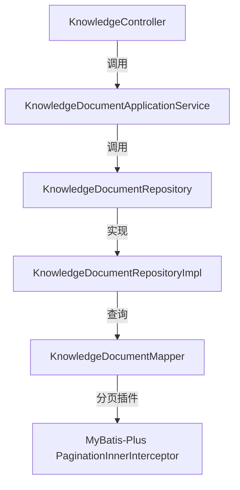

# FE017 - 知识库文档分页支持实施计划 (Implementation Plan)

本实施计划旨在为 `rest/biz/v1/knowledge/documents` 接口添加分页支持。为了保证线上平稳运行并符合微服务与 DDD 规范，本方案采用 **向下兼容的双模响应设计**，并在各层实现严格的关注点分离。

---

## 1. 整体技术方案与架构



### 1.1 双模设计说明
- **无分页请求**：若请求参数不带 `page` 和 `size`，控制器继续返回 `List<KnowledgeDocument>`，维持原有契约，100% 兼容存量调用方。
- **分页请求**：若请求参数携带 `page` 或 `size`，控制器将调用分页服务，返回通用的 `PageResult<KnowledgeDocument>` 对象。

---

## 2. 详细实现步骤

### 第一步：注册 MyBatis-Plus 分页插件 (Infrastructure Layer)
- 修改 `MybatisPlusConfig.java`：
  - 注册 `MybatisPlusInterceptor` Bean，并添加 `PaginationInnerInterceptor(DbType.POSTGRESQL)`，支持底层物理分页。

### 第二步：定义通用分页结果模型 (Domain Layer / Shared)
- 创建通用领域 Record：`com.dark.aiagent.domain.common.PageResult.java`。
- 包含字段：
  - `records`: 数据列表
  - `total`: 总条数
  - `size`: 每页大小
  - `current`: 当前页码
  - `pages`: 总页数

### 第三步：定义仓储层接口与实现 (Domain & Infrastructure Layers)
- 在 `KnowledgeDocumentRepository.java` 中增加分页查询接口：
  ```java
  PageResult<KnowledgeDocument> findByTopicIdPaged(String topicId, int page, int size);
  ```
- 在 `KnowledgeDocumentRepositoryImpl.java` 中实现该接口：
  - 利用 MyBatis-Plus 的 `Page<KnowledgeDocumentDO>` 进行分页查询。
  - 将查询得到的 `IPage<KnowledgeDocumentDO>` 转换为领域模型 `PageResult<KnowledgeDocument>`。

### 第四步：定义应用服务层接口与实现 (Application Layer)
- 在 `KnowledgeDocumentApplicationService.java` 中增加分页接口：
  ```java
  PageResult<KnowledgeDocument> getDocumentsByTopicPaged(String topicId, int page, int size);
  ```
- 在 `KnowledgeDocumentApplicationServiceImpl.java` 中实现此方法，调用 `documentRepository.findByTopicIdPaged`。

### 第五步：修改控制器层 (Interface Layer)
- 修改 `KnowledgeController.java` 中的 `getDocuments` 方法：
  - 参数添加可选的 `page` 和 `size` 参数。
  - 根据参数是否为空，执行双模逻辑：无参数时返回原始 `List`，有参数时执行分页查询并返回 `PageResult`。

---

## 3. 质量保证与测试策略 (TDD & Verification)

### 3.1 单元测试与集成测试
- **仓库层测试**：为 `KnowledgeDocumentRepositoryImpl` 添加单元测试，验证物理分页查询逻辑（包含 `total` 统计和 `records` 截断）。
- **控制器层测试**：在 `KnowledgeControllerTest.java` 中增加以下测试用例：
  1. `shouldReturnPlainListWhenNoPaginationParams`: 不带分页参数，返回 JSON 数组格式。
  2. `shouldReturnPageResultWhenPaginationParamsProvided`: 带分页参数，返回 PageResult 对象，校验 `total`、`current` 等属性。

### 3.2 自动化校验
- 启动 `ms-java-biz` 并执行 `mvn clean test` 确保所有单元测试全部通过。
