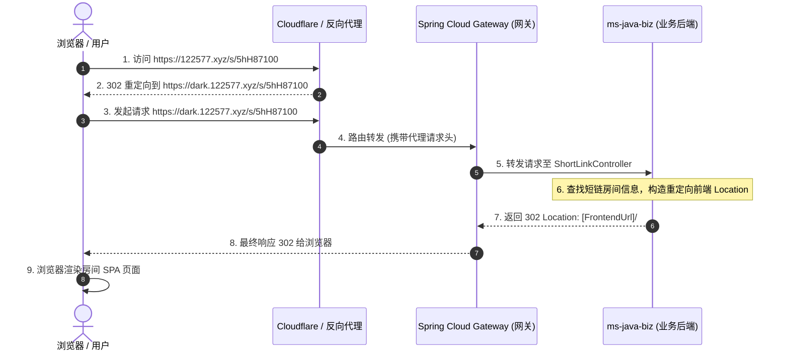

# 事故复盘：阅后即焚短链多级反向代理 X-Forwarded-Host 逗号列表引发 500 故障

## 1. 现象描述

**日期**：2026-05-28
**问题 TraceId**：`b98cce3bf85343adb1006676c43d6c9e`
**故障现象**：
用户访问阅后即焚短链 `https://122577.xyz/s/5hH87100`，由 CDN 或多级代理 302 重定向到 `https://dark.122577.xyz/s/5hH87100`。浏览器再次请求重定向地址时，业务系统抛出 `500 Internal Server Error` 并返回以下错误 JSON：
```json
{
  "traceId": "b98cce3bf85343adb1006676c43d6c9e",
  "status": 500,
  "error_code": "500",
  "error_msg": "内部系统错误，请联系管理员",
  "path": "/s/5hH87100",
  "timestamp": "2026-05-28T23:33:46.236498537Z"
}
```

---

## 2. 短链访问的完整时序与过程

在没有出现此故障前，一个健康的阅后即焚短链访问跳转链路如下：



---

## 3. 根因分析（RCA）

故障发生在上述第 **6 步**（在 `ShortLinkController` 的 `redirect` 方法中构建跳转 URL）。

### 根本原因：多级代理导致 X-Forwarded-Host 成为逗号分隔列表，破坏了 URI 语义

1. **多代理追加行为**：
   在真实的分布式生产环境下，用户的请求依次经过了多层反向代理或 CDN（例如：Cloudflare -> 边界 Nginx -> 业务 Nginx -> Spring Cloud Gateway）。
   在多级代理转发中，每经过一层代理，代理服务器为了保留请求的源 Host，会将自身接收到的 Host 追加到 `X-Forwarded-Host` 头部，用逗号分隔。
   因此，当请求到达 `ms-java-biz` 业务微服务时，后端获取到的 `forwardedHost` 值并非单一域名，而是一个**逗号分隔的 Host 列表**（如 `"122577.xyz, dark.122577.xyz"`）。

2. **非法 URL 拼接与 URI 解析器崩溃**：
   原本的代码中，没有对逗号分隔的 Host 进行任何裁剪和防御处理，直接进行拼接：
   ```java
   String scheme = (forwardedProto != null && !forwardedProto.isBlank()) ? forwardedProto : "https";
   return scheme + "://" + forwardedHost.trim();
   ```
   这导致在多级代理下拼装出来的 Base URL 变成了：`https://122577.xyz, dark.122577.xyz`。
   接下来，代码尝试生成最终的重定向 URI：
   ```java
   headers.setLocation(URI.create(base + "/#/room/" + code));
   ```
   这也就是 `URI.create("https://122577.xyz, dark.122577.xyz/#/room/5hH87100")`。由于拼接的字符串中包含了非法的逗号和空格等字符，Java 的 `URI.create()` 解析器崩溃，抛出 `java.lang.IllegalArgumentException: Illegal character in authority at index 8`。

3. **缺乏全局防御性降级**：
   在最初的版本中，重定向 Location 的构建闭包中没有使用 `try-catch` 块对异常进行兜底捕获。当 `URI.create()` 抛出非法字符的运行期异常时，该异常直接向上传播到 Spring MVC 和全局异常处理器，从而将异常转换成了标准的 `500 Internal Server Error`，使用户看到了 500 报错，而无法平滑跳转到房间。

---

## 4. 落地解决方案与修复实现

为了在各种极端多代理及配置缺失的环境下保障短链跳转的高可用，我们采取了以下**工业级强健壮性防御方案**：

### 4.1 多级代理 Host 自动裁切治理
在 `ShortLinkController.getFrontendBase` 解析 `X-Forwarded-Host` 和 `X-Forwarded-Proto` 时，增加对 `,` 字符的识别与切分。**永远只提取列表中的第一个有效的 Host / Proto**，并进行 trim 处理，规避拼装出非法 URL。
```java
// 2. 优先使用访问时的实际请求域名 (X-Forwarded-Host)
if (forwardedHost != null && !forwardedHost.isBlank()) {
    String host = forwardedHost.trim();
    // 解决多级反向代理场景下 X-Forwarded-Host 产生的以逗号分隔的域名列表
    if (host.contains(",")) {
        host = host.split(",")[0].trim();
    }
    String scheme = (forwardedProto != null && !forwardedProto.isBlank()) ? forwardedProto : "https";
    if (scheme.contains(",")) {
        scheme = scheme.split(",")[0].trim();
    }
    return scheme + "://" + host;
}
```

### 4.2 全流程 try-catch 异常安全降级保护
即使因为其它未预期原因（如配置项 NPE 隐患、恶意的特殊字符头注入等）导致重定向 Location 拼装失败，控制器也**绝对不允许抛出 500 系统崩溃**。
我们用 `try-catch` 严密包裹了重定向 Location 拼装逻辑。一旦捕获到任何异常，立即记录 warning/error 日志，并**安全地降级退化**到默认的生产前端域名（`app.frontend-url` 配置项或兜底 `"https://122577.xyz"`）构建 302 响应。这样能够 100% 保证不管外界请求如何多变，最终用户也一定能平滑地被重定向到可用的前端页面。

---

## 5. 自动化测试回归与验证

我们在 [ShortLinkControllerTest.java](file:///Users/pei/projects/ms-java-biz/src/test/java/com/dark/aiagent/ephemeral/interfaces/rest/ShortLinkControllerTest.java) 中新增了以下两个单元测试，全面覆盖这些异常与极端场景：

1. **多代理 Host 切割测试** (`redirect_with_multi_forwarded_hosts_should_use_first_host`)：
   模拟 `X-Forwarded-Host` 为 `"122577.xyz, dark.122577.xyz"`，验证系统是否正确截取并重定向到首位 Host 对应的 `https://122577.xyz/#/room/...`。
2. **异常防御安全降级测试** (`redirect_with_exception_should_fallback_to_default_domain`)：
   提供包含非法字符的恶意的 Host，迫使拼装引发 `IllegalArgumentException`，验证系统是否启动了防御降级策略，平滑且无感地把用户重定向到默认的 `"https://122577.xyz"` 前端。

### 本地测试运行结果
通过在 `ms-java-biz` 下执行：
```bash
source ~/.zshrc && mvn test -Dtest=ShortLinkControllerTest
```
测试执行成功，8 个用例全部以 **`BUILD SUCCESS`** 回归通过！

```text
[INFO] Running com.dark.aiagent.ephemeral.interfaces.rest.ShortLinkControllerTest
23:41:20.575 [main] INFO  c.d.a.e.i.r.ShortLinkController - 【ShortLink】重定向构造发生异常，启动防御性降级。code=PklcS100 referer=null forwardedHost=invalid host^name forwardedProto=null
java.lang.IllegalArgumentException: Illegal character in authority at index 8: https://invalid host^name/#/room/PklcS100
    ...
[INFO] Tests run: 8, Failures: 0, Errors: 0, Skipped: 0
[INFO] 
[INFO] ------------------------------------------------------------------------
[INFO] BUILD SUCCESS
[INFO] ------------------------------------------------------------------------
```

---

## 6. 经验与最佳实践总结

1. **多代理请求头防范意识**：在微服务开发中，不能假设所有的 HTTP 请求头（如 `X-Forwarded-Host`、`X-Forwarded-For`、`X-Forwarded-Proto` 等）都仅是单一变量。当有多级代理或 CDN 存在时，随时要做好对**逗号分隔列表**的安全防御与切分裁剪。
2. **跳转类接口的平滑降级（Graceful Degradation）**：重定向类控制器的最重要使命是“确保跳转成功”，它处于流量的出口处。这类核心交互接口在拼装跳转 Location 时，应始终具备 `try-catch` 防御机制和绝对可靠的**兜底域名（Default Domain）**，不能因为内部解析或配置问题导致用户浏览器面对冰冷的 500 JSON。
